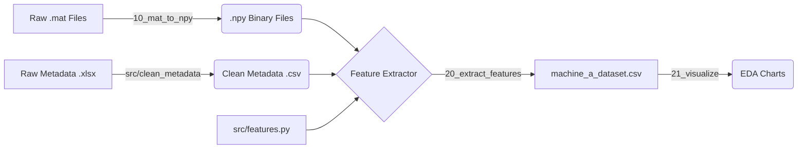

# JamShield ML Pipeline: Progress Report

**Date:** January 7, 2026
**Project Status:** Feature Engineering & Initial Training Complete
**Focus:** Machine A (Binary Classification: Clean vs. Jamming)

---

## 1. Architectural Overview

We have established a robust, modular pipeline designed to transform raw I/Q signal data into a trained Machine Learning model. The pipeline prioritizes **traceability** (linking predictions back to physical jamming parameters) and **extensibility** (easy addition of new mathematical features).

### The Data Pipeline

---

## 2. Key Achievements

### A. Data Standardization (The Foundation)

- **Conversion:** Converted massive `.mat` files (v7.3 HDF5) into fast-loading `.npy` files.
- **Silence Removal:** Implemented a **20,000 sample offset** at the start of every file to remove "warm-up silence." This prevents the model from learning that "Silence = Jamming" (Label Noise).
- **Metadata Cleaning:** Created `src/clean_metadata.py` to sanitize the messy Excel reference file. We now have a clean CSV that links every file ID (`w1`, `w2`...) to its physical properties (Jamming Power, Distance, Type).

### B. Modular Feature Engineering

We moved away from hard-coding math in notebooks. We now use a synchronized configuration system:

1. **`src/config.py`**: Defines the "Single Source of Truth." A list called `MACHINE_A_FEATURES` controls the entire pipeline.
2. **`src/features.py`**: A dedicated module containing the math logic. It uses an optimized orchestrator to pre-calculate Magnitude and Power once per chunk, improving performance.

**Current Feature Set:**

- **Mean Power:** Detects high-energy jamming.
- **Kurtosis:** Detects the "shape" of the distribution (Gaussian vs. Sine vs. Clean). Critical for low-power detection.
- **PAPR:** Peak-to-Average Power Ratio.

### C. Dataset Generation

- **Windowing:** Signals are sliced into **10,000 sample chunks** (0.4ms duration @ 25MHz).
- **Subsampling:** To manage RAM, we extract 5,000 random chunks per file.
- **Traceability:** Every row in the dataset includes:
- `filename`: Source file (e.g., `w1_sine.npy`)
- `jamming_power`: Physical power level (0.1, 0.3, 0.6...)
- `distance`: Distance from jammer.

### D. Visualization & Insights

We created `notebooks/21_visualize_dataset.ipynb` to audit the data.

- **The "Comet" Effect:** Visualization confirmed that while High Power Jammers (`w3`) are easily separable by Power, Low Power Jammers (`w1`) overlap significantly with Clean data.
- **Feature Validation:** Confirmed that **Kurtosis** provides separation for low-power signals where Mean Power fails.

---

## 3. Current Data Status

We have successfully processed the following scenarios:

| File ID | Scenario         | Jamming Power    | Status    |
| ------- | ---------------- | ---------------- | --------- |
| **w1**  | Clean/Sine/Gauss | **0.1 (Weak)**   | Processed |
| **w2**  | Clean/Sine/Gauss | **0.3 (Medium)** | Processed |
| **w3**  | Clean/Sine/Gauss | **0.6 (Strong)** | Processed |
| **w4**  | Clean/Sine/Gauss | **0.1 (Weak)**   | Processed |
